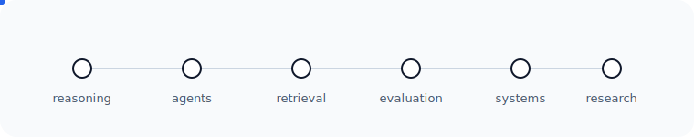
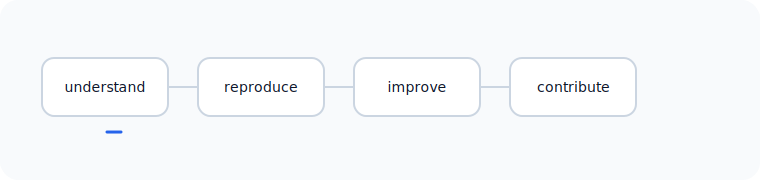

<div align="center">



# Vimalesh Boorle

### Building reliable AI systems.

**Reasoning · Agents · Evaluation · Retrieval · Infrastructure**

<sub>AI/ML Data Scientist</sub>

<br />

[LinkedIn](https://www.linkedin.com/) · [Email](mailto:vimalesh.boorle3@gmail.com)

</div>

---

## Current Focus

I work at the intersection of data science and applied AI, with a focus on systems that are measurable, observable, and useful in production.

- Agentic AI and tool-using systems
- LLM evaluation and benchmarking
- Retrieval, ranking, and context engineering
- Model Context Protocol and AI integrations
- Data science for AI products
- Reliable AI infrastructure

<p align="center">
  
</p>

---

## Selected Systems

| Project | Problem | Core Focus | Status |
|---|---|---|---|
| **Natural Language SQL** | Convert user intent into safe, verifiable analytical queries | Agents · Tool use · Evaluation | Building |
| **RAG Evaluation Lab** | Measure retrieval and answer quality across datasets | Retrieval · Ranking · Benchmarking | Planned |
| **Agent Memory System** | Preserve useful context without accumulating noise | Memory · Context · Reliability | Research |
| **AI Analytics Assistant** | Turn business questions into reproducible analysis | Data Science · LLM Systems | Planned |
| **Research Notes** | Document experiments, failures, and technical decisions | Applied Research · Writing | Ongoing |

> Replace these entries with repository links as each project becomes public.

---

## Open Source Direction

I am building toward meaningful contributions in:

- Model Context Protocol ecosystem
- LlamaIndex
- FastMCP
- OpenAI Cookbook
- DuckDB
- LLM evaluation tooling

<p align="center">
  
</p>

---

## Research Notes

A public notebook for ideas, experiments, evaluations, and lessons learned.

```text
research/
└── 2026/
    ├── agent-evaluation.md
    ├── memory-systems.md
    ├── retrieval-quality.md
    ├── reasoning-workflows.md
    └── reliable-ai-infrastructure.md
```

Each note should answer:

1. What problem am I investigating?
2. What did I test?
3. How did I evaluate it?
4. What failed?
5. What changed in my understanding?

---

## Engineering Approach

```text
Problem
  ↓
Hypothesis
  ↓
Architecture
  ↓
Implementation
  ↓
Evaluation
  ↓
Iteration
```

I prefer systems that are:

- **Reliable** — failure modes are understood and handled
- **Observable** — behavior can be inspected and measured
- **Evaluated** — quality is tested instead of assumed
- **Reproducible** — results can be repeated and explained
- **Useful** — technical work connects to real user outcomes

---

## Toolbox

**Core**

`Python` · `SQL` · `Statistics` · `Experimentation` · `Machine Learning`

**AI Systems**

`LLM APIs` · `Agent Workflows` · `RAG` · `Tool Calling` · `MCP` · `Evaluation`

**Data**

`Pandas` · `NumPy` · `Spark` · `Snowflake` · `Databricks` · `PostgreSQL`

**Infrastructure**

`FastAPI` · `Docker` · `GitHub Actions` · `AWS` · `Redis`

---

## Current Build Plan

```text
01  Natural Language SQL agent
02  Retrieval and RAG evaluation lab
03  Agent evaluation framework
04  MCP-based enterprise assistant
05  Open-source contributions
06  Public research notes
```

---

## Connect

- **Email:** [vimalesh.boorle3@gmail.com](mailto:vimalesh.boorle3@gmail.com)
- **LinkedIn:** Replace the placeholder link at the top with your actual profile
- **Portfolio:** Coming later, using the same visual language

---

<div align="center">

<sub>Technology changes quickly. Systems thinking lasts.</sub>

</div>
